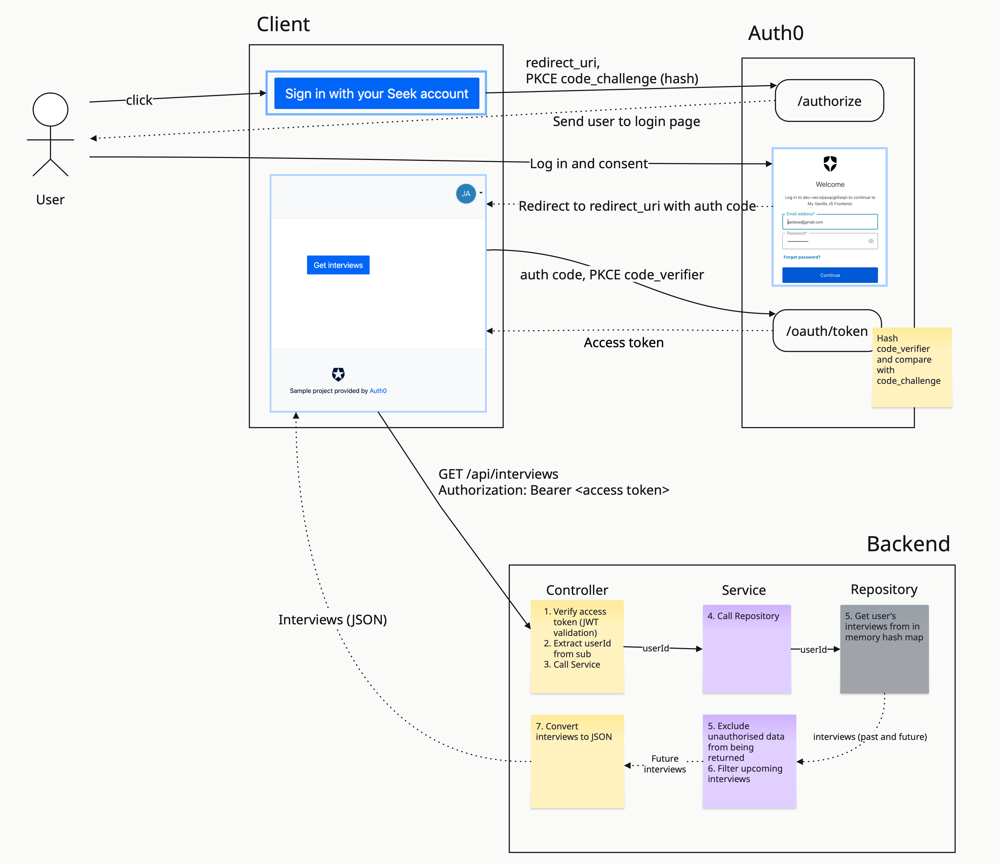
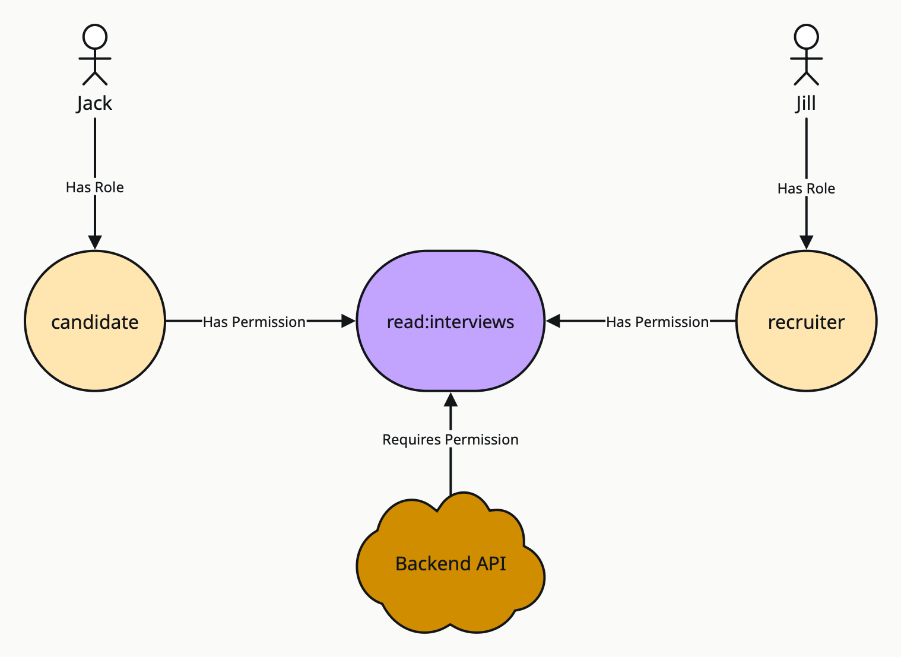

# Design Decisions and Trade-offs

## Design Decisions

### IDP Token Configurations

- Idle Refresh Token Lifetime: 7 days
- Refresh Token Rotation: Enabled
- Maximum Access Token Lifetime: 15 minutes

In a PoC, these lifetimes are not too important. 
In production we should aim for **short-lived tokens for adequate security** while maintaining good user experience. 

For instance, you do not want a user to have to log in every time they get onto the website.

### Access Control

The backend API is RBAC enabled and it requires the `read:interviews` permission.

A candidate, e.g. `jacklow@gmail.com`, is assigned the `candidate` role with `read:interviews` permissions.

Spring Security authorises that the incoming request `hasAuthority("read:interviews")`.

A recruiter, e.g. `recruiter-google@wjlow.com`, is assigned the `recruiter` role with `read:interviews` permissions.

### Multi-tenancy

A candidate would have interviews with multiple recruiters. From a candidate's perspective,
they want to retrieve all their upcoming interviews, regardless of recruiter.

On the other hand, a recruiter's view is different. They should only be able to see interviews that they have scheduled.

The recruiter backend flow is deliberately left out of this PoC.

### Explicit Authorization Check in Service

If the Service retrieves an interview that the current candidate is not authorized to see, the Service excludes it from
the response.

**Log a warning** to signal that something unexpected has happened.

In production, we would want to **push a metric and raise an alert**.

## Tradeoffs

### JWT Validation vs Introspection

I have chosen to use _JWT validation_ for this PoC.

_Introspection_ couples the backend API closely with the IDP. For every call the UI makes to the backend to fetch
interviews, the backend needs to make a call to the IDP. 

The upside of this is that the token status is verified in real-time, which is a major advantage in high security scenarios.

At scale, _JWT validation_ is preferable because:
- The risk of a revoked token being used before it expires is very low
- Less network calls to the IDP
- Since the validation is done locally, there is less latency
- Looser coupling with the IDP, which means we are less impacted by its availability and at high traffic, the IDP won't be a bottleneck

### Using Auth0 vs using self-hosted IDP

Using Auth0 for this PoC contributes to speed of development. For a production implementation,
a self-hosted IDP has some advantages:
- Potential long-term cost savings
- Avoiding vendor lock-in
- More control over specific organisational needs
